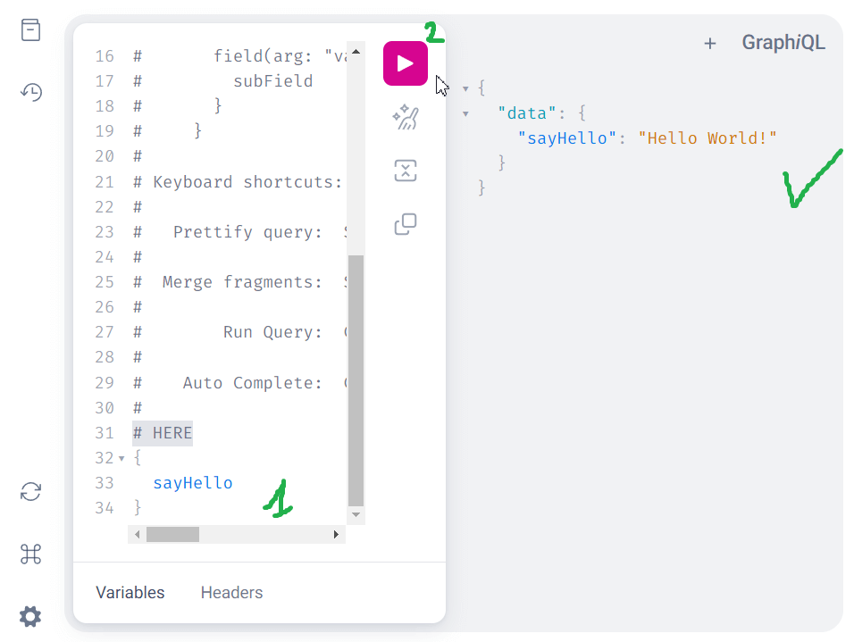

# 🌐 GraphQL

Management & usage through:

- GraphQL
- Mercurius, solid implementation for Fastify
- GraphiQL, GUI

## 🧠 GraphQL ?

TODO: 🌱 Completer

~= API Rest en mieux

Is a specification, not a language nor a technology. Must be implemented.

🔍 Resources:

- [GraphQL](https://graphql.org/)
- [GraphQL Best Practices](https://graphql.org/learn/best-practices/)
  - 🐯 [NestJs implementation](https://docs.nestjs.com/graphql/quick-start)
  - 💎 [Prisma implementation](https://www.prisma.io/graphql)
  - 🚨 Attention, dans les tutos NestJs, ils implémentent d'un côté GraphQL, de l'autre Prisma
    - 💩 Leurs exemples sont HS / incomplets

---

Scalar: GraphQL basic typed fields:

GraphQL comes with a set of default scalar types out of the box:

- Int: A signed 32‐bit integer.
- Float: A signed double-precision floating-point value.
- String: A UTF‐8 character sequence.
- Boolean: true or false.
- ID: The ID scalar type represents a unique identifier, often used to refetch an object or as the key for a cache. The ID type is serialized in the same way as a String; however, defining it as an ID signifies that it is not intended to be human‐readable.

🚨 Everything else is either a **custom scalar type** (~= Date) either an **agregation of scalar types** (~= `ObjectType`)

---

## 📦️ Installation

Mix of [NestJs](https://docs.nestjs.com/graphql/quick-start) & [Mercurius](https://mercurius.dev/#/docs/integrations/nestjs) documentations

💩 Mercurius example doesn't work, it misses somes files.

```bash
## Opt. Remove express
#     see   https://mercurius.dev/#/docs/integrations/nestjs
bun remove @nestjs/platform-express

# For Fastify and Mercurius
# npm i @nestjs/graphql @nestjs/mercurius graphql mercurius
# 🐛 Added @mercuriusjs/gateway to prevent a missing dependancy at runtime
bun i @nestjs/graphql @nestjs/mercurius graphql mercurius @mercuriusjs/gateway
```

---

## 🔧 Configuration

Update `app/src/app.module.ts`

```ts
// Adapter
import { Module } from '@nestjs/common';
import { GraphQLModule } from '@nestjs/graphql';
import { MercuriusDriver, MercuriusDriverConfig } from '@nestjs/mercurius';
import { join } from 'path';

@Module({
  imports: [
    GraphQLModule.forRoot<MercuriusDriverConfig>({
      // GraphQL schema generated on-the-fly in memory
      // autoSchemaFile: true,
      // * GraphQL schema generated in a file
      autoSchemaFile: join(process.cwd(), 'src/schema.gql'),
      driver: MercuriusDriver,
      // * Enable GUI
      graphiql: true,
      // Sort the GraphQL schema lexicographically
      sortSchema: true,
    }),
  ],
})
export class AppModule {}
```

---

### 📌 Testing

Re-use the Hello world resolver, previously created for Apollo.

`src/hello.module.ts`

```ts
// * 🌐 GraphQL
import { Module } from '@nestjs/common';
import { HelloResolver } from './hello.resolver';

@Module({
  imports: [],
  exports: [HelloResolver],
  controllers: [],
  providers: [HelloResolver], //< This
})
export class HelloModule {}
```

---

`src/hello.resolver.ts`

```ts
// * 🌐 GraphQL
import { Resolver, Query } from '@nestjs/graphql';

@Resolver()
export class HelloResolver {
  @Query(() => String)
  async sayHello(): Promise<string> {
    return `Hello World!`;
  }
}
```

To test the resolver:

#### ✅📌 Direct HTTP call

Simply go to [localhost:3000/graphql?query={sayHello}](http://localhost:3000/graphql?query={sayHello})

#### ✅📌 Through GraphiQL

Go to [localhost:3000/graphiql](http://localhost:3000/graphiql)

Add the request `{ sayHello }` and press the play button.

A screenshot of GraphiQL with hello world



---

## 🌐👌 GraphQL > Use graphql-scalars

🔍 [NestJs > GraphQL > Scalars](https://docs.nestjs.com/graphql/scalars)

The code-first approach ships with five scalars in which three of them are simple aliases for the existing GraphQL types.

- **ID** (alias for GraphQLID) - represents a unique identifier, often used to refetch an object or as the key for a cache
- **Int** (alias for GraphQLInt) - a signed 32‐bit integer
- **Float** (alias for GraphQLFloat) - a signed double-precision floating-point value
- **GraphQLISODateTime** - a date-time string at UTC (used by default to represent Date type)
- ~~GraphQLTimestamp~~ - a signed integer which represents date and time as number of milliseconds from start of UNIX epoch

📦️ Adding a package "graphql-scalars" to add more:

Common custom GraphQL Scalars for precise type-safe GraphQL schemas

Ready to use, 🔍 [See the documentation](https://the-guild.dev/graphql/scalars/docs/quick-start#integration-to-your-existing-graphql-schema)

Lots of common types:

- AccountNumber
- BigInt
- Byte
- CountryCode
- Cuid
- Currency
- Date
- DateTime
- DeweyDecimal
- DID
- Duration
- EmailAddress
- HexColorCode
- Hexadecimal
- HSL
- IBAN
- IP
- IPCPatent
- IPv4
- IPv6
- ISBN
- JSON
- JSONObject
- JWT
- Latitude
- LocalDate
- LocalDateTime
- LocalEndTime
- LocalTime
- Locale
- Longitude
- MAC
- NegativeFloat
- NegativeInt
- NonEmptyString
- NonNegativeFloat
- NonNegativeInt
- NonPositiveFloat
- NonPositiveInt
- ObjectID
- PhoneNumber
- Port
- PositiveFloat
- PositiveInt
- PostalCode
- RegularExpression
- RGB
- RGBA
- RoutingNumber
- SafeInt
- SemVer
- Time
- TimeZone
- Timestamp
- URL
- USCurrency
- UTCOffset
- UUID
- Void

---

## 📝 Notes about differences between REST and GraphQL

- DTOs, différences
  - REST > `xxx.dto.ts`
  - GraphQL > `xxx.input.ts`
    - Used to return **object typed** created/updated instance after a mutation
    - See [NestJs > Mutations](https://docs.nestjs.com/graphql/mutations)

- Entities
  - REST > `@Field`
  - GraphQL > `@ApiProperty()`

---

### 🔍 Formation Mercurius, rapidement (graphql pour fastify)

- [Doc](https://mercurius.dev/#/)
  - Implémentation des principes de GraphQL, sur Fastify
  - Création de ~tout ce qu'il faut de base
  - Dans l'ensemble la doc se lit extrêmement vite, c'est plus un dictionnaire avec des exemples ✅
- Ajout de batched queries a la liste des TODO
- Implémentation de [Typescript](https://mercurius.dev/#/docs/typescript)
  - Possibilité d'utiliser le GraphQL Code Generator (mais a priori plus pour schema first)
  - 🌱 A voir ptet plus tard en fonction de l'installation via NestJs
- 👷 NestJs > reco doc nestjs OOB lol [nice](https://mercurius.dev/#/docs/integrations/nestjs)
- 👷 [Prisma pour Mercurius](https://mercurius.dev/#/docs/integrations/prisma)
- 🌱 Pas mal de [plugins](https://mercurius.dev/#/docs/plugins)
  - mercurius-auth
  - mercurius-cache
  - mercurius-validation
  - mercurius-upload
  - altair-fastify-plugin
  - mercurius-apollo-registry
  - mercurius-apollo-tracing
  - mercurius-postgraphile
  - mercurius-logging
  - mercurius-fetch
  - mercurius-hit-map
